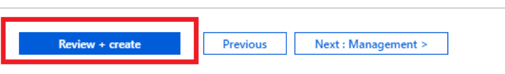
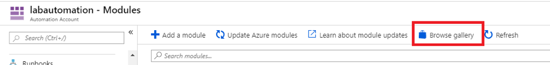

# Lab 1: Provision a server via the Azure Portal and use DSC to configure the IIS role

1. Log onto the [Azure Portal](https://portal.azure.com) (https://portal.azure.com):

2. Choose ‘Create a resource’:

3. Start typing ‘Virtual Machine’ until the option to create a Virtual Machine is displayed and then click on it:

4. Click the blue ‘Create’ button at the bottom of the screen:

5. Fill in the parameters as per the screenshot below for your virtual machine:

6. On the ‘Networking’ tab, if you do not have a demo / test virtual network (VNET) already provisioned then choose ‘Create new’ and fill in the parameters as per screenshot below:

7. The remainder of the ‘Networking’ settings can be left as default including the creation of a new public IP Address for your VM:

8. Click ‘Review + create’ and then ‘Create’ once the validation has passed:

9. Whilst the VM is provisioning, we can create an Azure Automation account which is required to setup and apply DSC profiles.

Click ‘Create a resource’ and start typing ‘Automation’ until the option of creating an Automation account appears and then click on it:

10. Click on the blue ‘Create’ button at the bottom of the screen:

11.	Fill in the parameters as per the screenshot below and then click ‘Create’:

12. Confirm your VM from step #8 has successfully completed provisioning by choosing ‘Virtual machines’ from the left hand menu (if you do not have a Virtual machines shortcut then just type the name of your VM into the search box at the top):

13. Verify the status is ‘Running’ and note the public IP Address that has been assigned:

14. RDP into the VM by clicking the ‘Connect’ button at the top using the credentials you provided in step #5 and verify you can logon on successfully:

15.	In the Azure portal start typing ‘Automation’ into the search bar until your Automation account that you provisioned in step #11 is displayed, then click on it:

16.	Click on ‘State configuration (DSC)’:

17.	Click on ‘Gallery’:

18.	Click on ‘WindowsIISServerConfig’:

19.	Click on ‘Import’ and then the blue ‘OK’ button:

20.	Click on ‘labautomation – State configuration (DSC) to get back to the main dashboard:

21.	Click on ‘Configurations’ and verify that the WindowsIISServerConfig PS configuration imported successfully:

22.	Click on ‘WindowsIISServerConfig’:

23.	Click on ‘Compile’ and ‘Yes’:

24.	Click on ‘labautomation – State configuration (DSC) to get back to the main dashboard:

25.	Click on ‘Compiled configurations’ and then click ‘Refresh’. Note that the WindowsIISServerConfig does not appear:

26.	Click on ‘Configurations’ and then ‘WindowsIISServerConfig’:

27.	Note that the status is marked as ‘Suspended’. Click on the status and note the exception error displayed:

28.	This error message is displayed because we haven’t (yet) loaded the PS module for IIS administration into our DSC repository. 

Delete the WindowsIISServerConfig module from the pull server clicking ‘Yes’ at the prompt:

29.	 Click on ‘lab automation – State configuration (DSC)’ to return to the main dashboard:

30.	Click on ‘Modules’ from the left-hand side menu:

31.	Click on ‘Browse Gallery’:

32.	Type ‘xWeb’ and press enter:

33.	Click on the xWebAdministration module and choose ‘Import’ and ‘OK’:

34.	Click ‘labautomation – Modules’ to confirm that the xWebAdministration module has now been loaded (it may show as importing for a brief period):

35.	Click on ‘State configuration (DSC)’ to return to the DSC dashboard and repeat steps #17 thru #23 to import the WindowsIISServerConfig DSC profile again:

36.	Click on ‘Configurations’ and then ‘WindowsIISServerConfig’:

37.	Note that the status is marked as ‘Suspended’ again. Click on the status and note the same exception error displayed as in step #27:

38.	Compare the version of xWebAdministration that the WindowIISServerConfig PS is looking for versus the version that we have loaded into our PS modules:

39.	In order to edit the WindowsIISServerConfig PS to utilise the later version of xWebAdministration we can export the script, make a simple edit and re-upload it. 
Click ‘Export’ at the top of the screen and save the WindowsIISServerConfig PS locally on your PC:

40.	Open the PS script with a text editor and change the value of the xWebAdministration version from 1.19.0.0 to 2.5.00 and save it:

41.	Delete the existing WindowsIISServerConfig module from the pull server clicking ‘Yes’ at the prompt:

42.	Click on ‘lab automation – State configuration (DSC)’ to return to the main dashboard:

43.	Click on ‘Add’ and browse to the edited PS file you created in step #40 clicking ‘OK’ to confirm:

44.	Repeat steps #22 thru #25 to compile the edited WindowsIISServerConfig PS and add it to the pull server. Note that this time it should load successfully:

45.	Click on ‘lab automation – State configuration (DSC)’ to return to the main dashboard and then click on ‘Nodes’:

46.	Click on ‘Add’:

47.	Pick the VM you provisioned at the start of this lab and click connect:

48.	Choose the WindowsIISServerConfig profile from the dropdown menu leaving everything else as default, then click OK:

49.	The VM should show “Connecting” and eventually ‘Connected’. Your VM should then show up under nodes as ‘Compliant’:

50.	Log onto your VM via RDP and verify that the IIS role is now installed. You can also look in the Windows Event Viewer to verify configuration was done via Azure Automation (DSC):

[<- Introduction](https://github.com/gidavies/MovingToInfraAsCodeLab/blob/master/README.md) | [Lab 2: Work with an ARM template from an existing resource](https://github.com/gidavies/MovingToInfraAsCodeLab/blob/master/MoveIacLab2.md)
