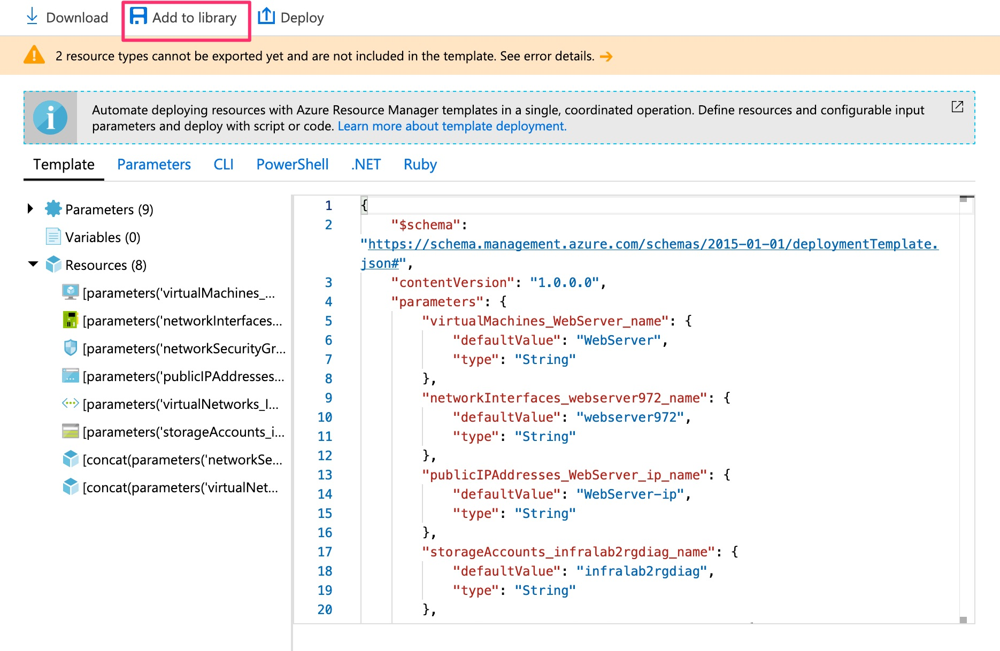

# Lab 2: Work with an ARM template from an existing resource

This lab will step through exporting an ARM template from a virtual machine and then reusing it as Infrastructure as Code in the Azure Portal.

This lab will create a new Virtual Machine in order to keep the steps simpler as the previously created VM will have a large number of paramters related to DSC (a total of 55 parameters).

## Part 1: Export an ARM Template from an existing resource

1. In the [Azure Portal](https://portal.azure.com) (https://portal.azure.com)  go to Create a Resource and select Windows Server DataCenter 2016:

2. Create a new resource group (to keep it seperate from the earlier VM), and complete the name, username and password fields. Add the RDP port and then click review and create (i.e. keep all other defaults for storage and networking), then create when the validation is complete:

3. Find the Virtual Machine that you created in the previous lab, and select the Export Template blade: 

4. Take a moment to look at the exported ARM template, the parameters and how you could use CLI, Powershell or code to invoke the ARM template. Some resources can't be exported at the moment but you can ignore those warnings for now and then click Add to Library:

5. Give the template a name and optionally a description, and then click Save:

6. Search for templates in the Azure Portal search and select Templates (preview):

7. You should see your template listed and you now have the start of a library of templates from which to create new resources:

## Part 2: Creating new resources from templates in the library

1. In the templates click on your newly created template:

2. There are options to edit the template which we'll explore later, but for now select Deploy:

3. This will now create a new VM using the ARM template. Create a new resource group so that you can easily see (and later delete) everything that gets created. Notice that various parameters are exposed for you to override. In order to clearly understand what will get created add your initials as a prefix to each of the first six parameters. The remainder can be left as defaults:

4. Review the terms and conditions at the bottom of the page, check the box and click Purchase:

5. The new Virtual Machine will then be created and deployed. Note that at the time of writing you may see an error in the deployment:

This appears to be an incorrect error and the virtual machine will be successfully created.

6. Navigate to the resource group created in the deployment and you will be able to see all of the resources created from your template:

7. Optionally RDP in to the virtual machine to validate the deployment. You can also stop the VM and/or delete the resource group just created now as this is no longer needed. You can redeploy in the same way whenever you want from the template library.

## Part 3: Editing the template

1. Open ARM template for editing

2. Observe vm size hard coded line 53

3. Line 40 add this parameter (note comma before):

'''javascript
,
        "virtualmachineSize": {
            "defaultValue": "Standard_DS1_v2",
            "type": "String"
        }
'''

[Lab 1: Create a virtual machine in the portal](https://github.com/gidavies/MovingToInfraAsCodeLab/blob/master/MoveIacLab1.md) | [Lab 3: Creating ARM templates from scratch](https://github.com/gidavies/MovingToInfraAsCodeLab/blob/master/MoveIacLab3.md)
