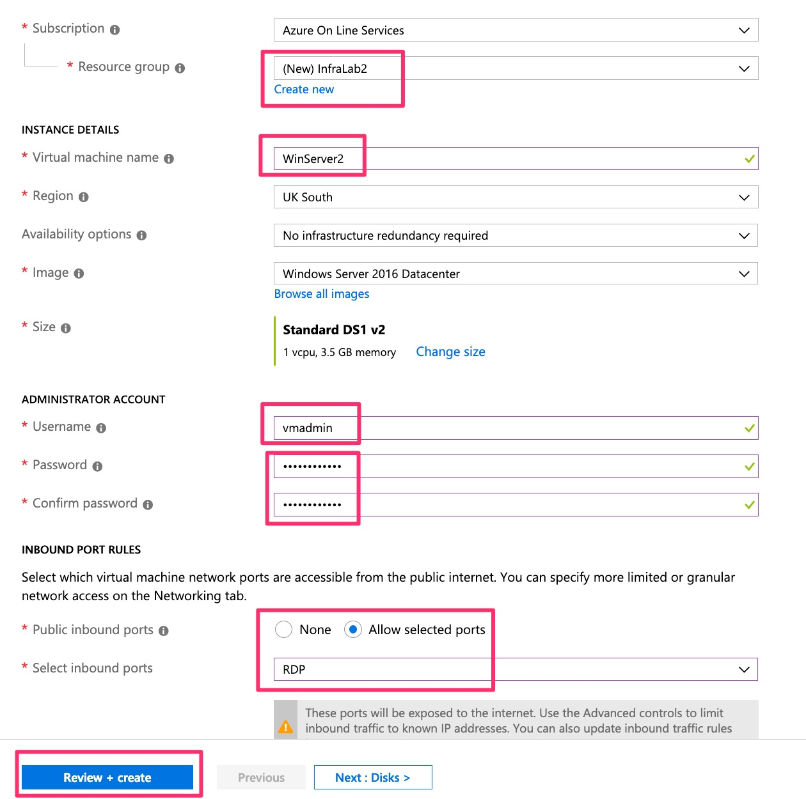
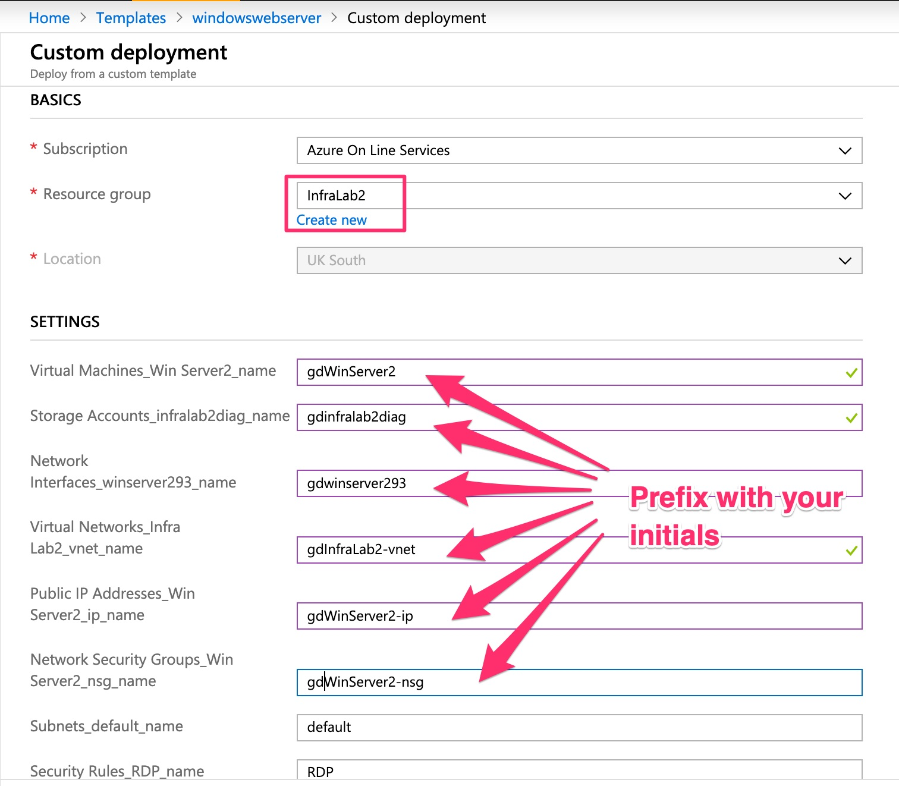
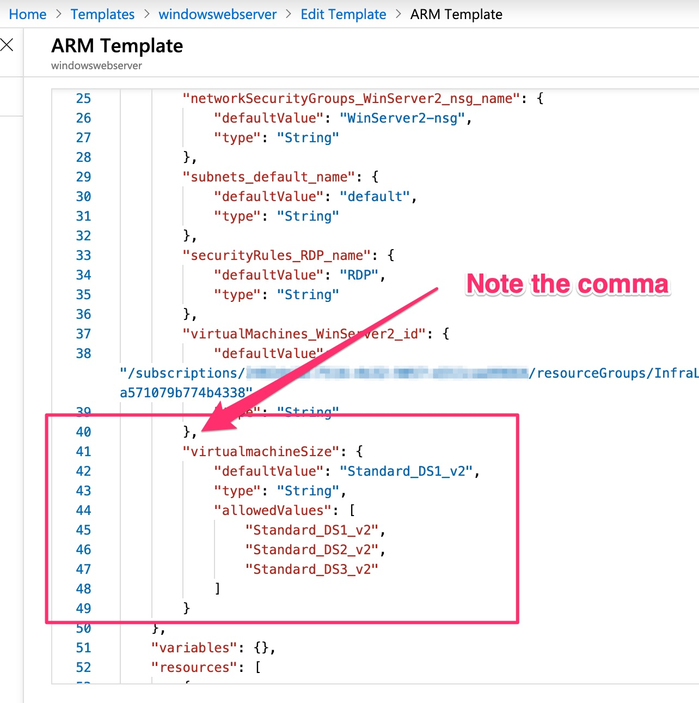

# Lab 2: Work with an ARM template from an existing resource

[<- Lab 1: Provision a server via the Azure Portal and use DSC to configure the IIS role](https://github.com/gidavies/MovingToInfraAsCodeLab/blob/master/MoveIacLab1.md) | [Home](https://github.com/gidavies/MovingToInfraAsCodeLab/blob/master/README.md) | [Lab 3: Creating ARM templates from scratch ->](https://github.com/gidavies/MovingToInfraAsCodeLab/blob/master/MoveIacLab3.md)

This lab will step through exporting an ARM template from a virtual machine and then reusing it as Infrastructure as Code in the Azure Portal.

The Virtual Machine created in the previous lab generates a large number of parameters related to DSC configuration so in order to keep the steps simpler a new VM will be created first.

## Part 1: Export an ARM Template from an existing resource

1. In the [Azure Portal](https://portal.azure.com) (https://portal.azure.com)  go to Create a resource and select Windows Server 2016 Datacenter:


2. Create a new resource group (to keep it separate from the earlier VM), and complete the name, username and password fields. Add the RDP port and then click review and create (i.e. keep all other defaults for storage and networking), then create when the validation is complete:



3. Navigate to the Virtual Machine that you just created (no need to wait for it to be running), and select the Export Template blade: 


4. Take a moment to look at the exported ARM template, the parameters and how you could use CLI, Powershell or code to invoke the ARM template. Some resources can't be exported at the moment but you can ignore those warnings for now and then click Add to library:


5. Give the template a name and a description, and then click Save:


6. Search for templates in the Azure Portal search and select Templates (preview):


7. You should see your template listed and you now have the start of a library of templates from which to create new resources on demand:


## Part 2: Creating new resources from templates in the library

1. In the templates click on your newly created template:


2. There are options to edit the template which we'll explore later, but for now select Deploy:


3. This will now create a new VM using the ARM template. Create a new resource group so that you can easily see (and later delete) everything that gets created. Notice that various parameters are exposed for you to override. In order to clearly understand what will get created add your initials as a prefix to each of the first six parameters. The remainder can be left as defaults:



4. Review the terms and conditions at the bottom of the page, check the box and click Purchase:


5. The new Virtual Machine will then be created and deployed. Note that at the time of writing you may see an error in the deployment:


This appears to be an incorrect error and the virtual machine will be successfully created.

6. Navigate to the resource group created in the deployment and you will be able to see all of the resources created from your template:


7. Optionally RDP in to the virtual machine to validate the deployment. You can also stop the VM and/or delete the resource group just created as this is no longer needed. You can redeploy in the same way whenever you want from the template library.

## Part 3: Editing the template parameters to provide allowed values

1. In the template library open the ARM template for editing (Edit | ARM Template). Maximise the editing window to make it easier to work on the file:


2. Notice that the virtual machine size is hardcoded at line 53 in the ARM template to be a Standard_DS1_v2:


3. We want to provide a list of sizes that may be used. First that requires a new parameter in the ARM template file. At the end of the current parameters we will add a new VM size parameter. At line 40 add the following, noting that the final existing parameter needs to have a comma added after it as it is no longer the last member of the parameters array:

```javascript
        ,
        "virtualmachineSize": {
            "defaultValue": "Standard_DS1_v2",
            "type": "String",
            "allowedValues": [
                "Standard_DS1_v2",
                "Standard_DS2_v2",
                "Standard_DS3_v2"
            ]
        }
```


This adds a new parameter that provides three size options for the VM.

4. Next the parameter needs to be used in the main body of the ARM template. Go to line 62 (used to be line 53 before adding the parameter above):


and replace that line with the following:

```javascript
"vmSize": "[parameters('virtualmachineSize')]"
```


This is now taking it's value from the newly added parameter. Click OK and then Save.


5. Click Deploy and see that new parameter is shown and the allowed values are listed:


6. No need to deploy another VM as this part was to show you how to customise the ARM Template but if you do create another VM then again, create a new resource group, add a unique suffix to the parameters and remember to delete the resource group once you've created and validated it.

[<- Lab 1: Provision a server via the Azure Portal and use DSC to configure the IIS role](https://github.com/gidavies/MovingToInfraAsCodeLab/blob/master/MoveIacLab1.md) | [Home](https://github.com/gidavies/MovingToInfraAsCodeLab/blob/master/README.md) | [Lab 3: Creating ARM templates from scratch ->](https://github.com/gidavies/MovingToInfraAsCodeLab/blob/master/MoveIacLab3.md)
