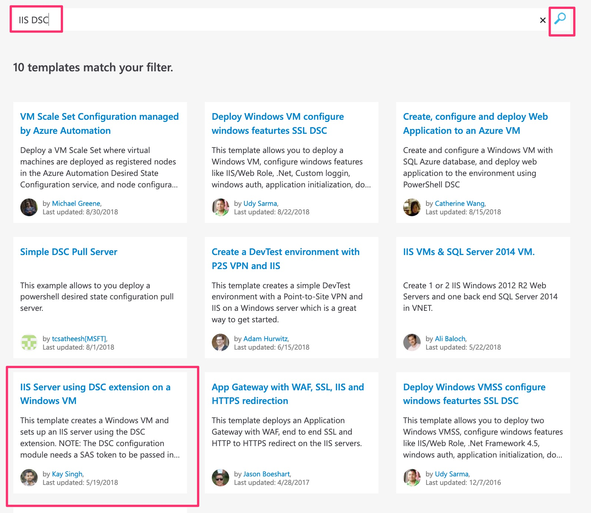

# Lab 3: Creating ARM templates from scratch

This lab will walk through some of the options for creating ARM templates.

## Part 1: Azure QuickStart Templates

1.  In a browser navigate to the [Azure QuickStart Templates](https://azure.microsoft.com/en-us/resources/templates/) (https://azure.microsoft.com/en-us/resources/templates/). This is a community resource of hundreds of examples of ARM Templates, from Microsoft and 3rd parties. If you have an infrastructure configuration in mind it's always worth searching to see if there are examples that would deliver, or at least give you a good start in creating, the ARM Templates required. We'll walk through finding an ARM template to match the manually created Windows Server with IIS Feature enabled in Lab 1.

2. In the Search field enter "IIS DSC", and select the "IIS Server using DSC extension on a Windows VM" option:

3. Take a look at the information on the page, which includes details of the ARM template, the parameters to be supplied and examples of how to invoke the ARM template from the command line and powershell. Every ARM template in the QuickStart Gallery maintains the ARM template files in GitHub so that they are available to be reused. To take a look, once you've had a look at the information on the page, select Browse on GitHub:

4. You'll see a list of all the files in the GitHub repo. The most important are the .json files for the ARM Template itself, and the parameters file. Click on the azuredeploy.json file:

5. You'll now see the contents of the ARM Template, most of which you should now be familiar with (parameters, resources etc.). Scroll down to the bottom of the template to see how DSC is used to enable the IIS feature on the Windows VM. Note that the DSC script that is to be run is passed in as a parameter (modulesURL):

6. To understand where the modulesURL is set and what it points to, go back in the browser to the previous contents page and select the azuredeploy.parameters.json file:

7. The parameters file sets all the default parameters to be passed into the main ARM template, unless they are overridden. Note that the default value for modulesURL is to a file in the same GitHub repository:

Copy the modulesURL value (https://github.com/Azure/azure-quickstart-templates/raw/master/dsc-extension-iis-server-windows-vm/ContosoWebsite.ps1.zip) to the clipboard or notepad for use in a minute.

8. Go back to the previous contents page again and the file that is being referenced in the parameter is the .ps1.zip file:

9. You could fork or download the files and then change them or reuse them as you see fit but let's return to the Azure QuickStart page (back in the browser or if needed search for the template again as above). Click on the Deploy to Azure button to deploy directly into your subscription:

10. You will be taken into the Azure Portal and onto the template deployment page. Check all the fields but create a new resource group (again for easy deletion), vm name, admin user, password and copy in the modulesURL from above. Then agree to the terms and conditions and click Purchase:

11. You should see the deployment gets underway:

12. Find the VM in the portal and once it shows as running select the extensions blade to see that DSC has been configured and is in the process of updating the VM:

13. Select the status details and, depending on timing, you'll see it's status change from transitioning to succeedeed:

14. If you want to confirm, connect to the VM and you'll see that the IIS feature is enabled and running and/or open the browser and connect to http://localhost to see the default IIS page running.

This VM won't be needed any longer so delete the resource group whenever you've finished to ensure minimum cost.

## Part 2: Creating an ARM template in the Portal

1. In the Azure Portal select Create a resource and search for Template Deployment:

2. Select Create on the next page:

3. You will see that are many options including some common templates and all the Azure QuickStart templates from Part 1 (including the IIS DSC example you used, shown selected in the screenshot). Select build your own template in the editor:

4. You'll then have a blank ARM template. Note that you can add resources (e.g. a virtual machine, a virtual network etc.) piece by piece or choose again from the QuickStart Templates. Select the QuickStart Template:

5. Search for the template used earlier by typing DSC into the field and selecting dsc-extension-iis-server-windows-vm:

6. Confirm by clicking OK:

7. The blank ARM Template has now been replaced with the one you used in the previous part above:

8. Edit the template to change the default VM size to "Standard_DS1_v2" and add an additional allowed value for the image SKU of "2016-Datacenter". Note that, again, the preceeding allowed value needs a comma added:

9. Click Save and then you will be presented with the deployment screen. Note that your changes are now showing:

10. If you want to then test out your changes by completing the fields and deploying a new VM. Again, the recommendation is to create a new resource group and then to delete the resource group when you are finished with it. If you select the deployment notification and click on Deployment:

you can also select the template and add it into the library for reuse:

## Part 3: Creating an ARM Template in Visual Studio

1. The Portal editor is good, but in can be preferable to work offline and/or with more editing options and other capabilities, such as adding ARM Templates to source control. Visual Studio provides good ARM Template editing support. Open Visual Studio and select File | New | Project and select Cloud | Azure Resource Group. Save the solution name and location as you wish and then click OK:

>If you don't see the Cloud option, then you need to make sure that Azure Development is enabled in Visual Studio. Open the Visual Studio Installer, select modify and check the Azure Development section:

>

2. You will then be presented with a dialog offering ARM templates to choose from. Note that you can select from some basic templates or from the Azure QuickStart gallery templates you used earlier:

3. Select the Visual Studio Templates and then choose Windows Virtual Machine. Click OK:

4. You will now have a new solution with 3 files in it:
- Deploy-AzureResourceGroup.ps1: A powershell script to deploy the ARM Template. If you are not going to deploy via Powershell then you can ignore or delete this file.
- WindowsVirtualMachine.json: The ARM Template itself.
- WindowsVirtualMachine.parameters.json: The ARM Template parameters file.

5. Open the WindowsVirtualMachine.json file to see the JSON file in the editor:

6. Find the WindowsOSVersion parameter and add an additional line to allowedvalues e.g. 2016-Datacenter but DON'T add the preceeding comma in order to see how the editor will help you. Notice that Visual Studio displays a green squiggly line to indicate an issue. If you hover over it, it will say that a comma is missing:

7. Add in the missing comma and save the file:

8. Open the JSON Outline view (usually on the left hand side of Visual Studio). You may want to pin it open for convenience. THis allows you to see the elements in the ARM Template and if you click on an element (e.g. a parameter) then it selects that element in the ARM Template. This can make understanding and navigating around the ARM Template much easier:

Try selecting different parameters, variables and resources.

9. You can add in additional elements in the JSON outline view. Right-click on the Resources section and select Add new resource:

10. Take a look at the options in the resource list. To replicate what we did earlier for example you could add in a DSC extension. For this lab there is no need to actually add them in, just be aware:

11. To deploy an ARM Template from Azure right-click on the solution and select Deploy | New:

12. Then complete the fields in the dialog, including creating a new resource group (if desired):

Feel free to deploy (and later delete) anything you've created but for this lab it's not necessary, understanding that you can deploy directly from Visual Studio is the aim.

[Lab 2: Work with an ARM template from an existing resource](https://github.com/gidavies/MovingToInfraAsCodeLab/blob/master/MoveIacLab2.md) | [Lab 4: Failover between regions](https://github.com/gidavies/MovingToInfraAsCodeLab/blob/master/MoveIacLab4.md)
