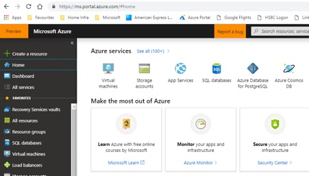

# Lab 4: Failover between regions

This lab will create a working release pipeline using Azure DevOps that will form the basis of the later labs.

# Step 1: 

In a browser navigate to the [Azure Portal](https://portal.azure.com) (https://portal.azure.com).

Login with the identity associated with the Azure subscription you want to use.

Navigate to the 

[Lab 3: Creating ARM templates from scratch](https://github.com/gidavies/MovingToInfraAsCodeLab/blob/master/MoveIacLab3.md) | [Lab 5: IaaS Automation](https://github.com/gidavies/MovingToInfraAsCodeLab/blob/master/MoveIacLab5.md)
