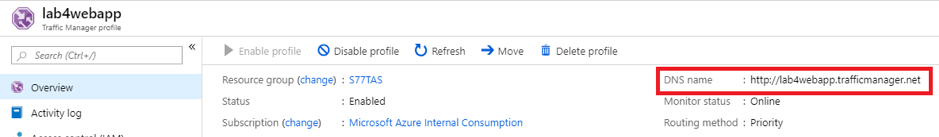
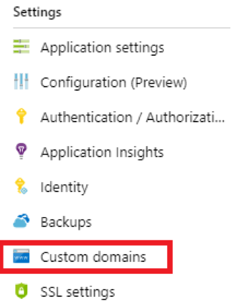
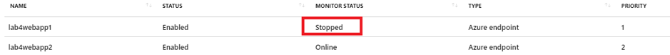
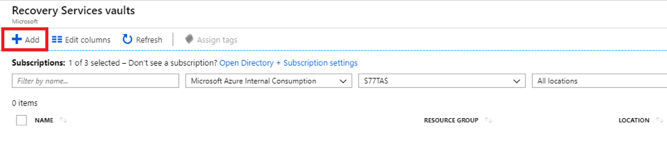
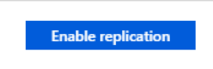

# Lab 4: Failover between regions

# Part 1: Use Azure Traffic Manager to provide geo-redundancy for a Web App

1. Load Visual Studio (Community Edition available for free here):
 


2. Click File > New > Project:


3. Choose ‘ASP.net Core Web Application’:


4. Give the project a name that’s easy to identify:
 


5. Choose ‘Web Application (Model-View-Controller)’ and untick ‘Enable Docker Support’ and ‘Configure for HTTPS’, then click ‘OK’:


6. If it doesn’t display automatically, click ‘View > Solution Explorer’:
 


7. In the Solution Explorer on the right hand side of the screen, expand Views > Home and click on ‘Index.cshtml’:


8. Select all of the default text in the left-hand pane of Visual Studio and delete it:


9. Type / paste in some basic HTML that identifies this Web App (sample below):

```html
<!DOCTYPE html>
<html>
<body>

<h1>This is <name>’s WebApp</h1>

<p>This is WebApp 1</p>

</body>
</html>
```
	 


10. Click ‘Save’:


11. In ‘Solution Explorer’ right click your Web App and choose ‘Publish’:
 


12. Choose ‘App Service’ and ‘Create New’ from the options and then click ‘Publish’ (note if you’ve not logged into an Azure subscription already you may be prompted to do so):
 


13. Choose an ‘App Name’ that is easily identifiable and choose an appropriate Resource Group for your web app, alternatively you can create a new one. For ‘Hosting Plan’ select ‘New’ and choose an App Service Plan name that is easily identifiable. Choose a location of ‘UK South’ and a size of ‘S1’. Then click ‘Create’:
 


14. In the Azure portal, type in ‘App Services’ in the search bar at the top until the ‘App Services’ resource is displayed and then click it:


15. Verify your Web App appears:
 


16. Click on your Web App to display the overview dashboard:


 
17. Click on ‘SSL Settings’:


18. Set ‘HTTPS Only’ to ‘Off’:
 


19. Click on ‘Overview’ on the left-hand menu for the Web App:


 
20. Click on ‘Restart’:


 
21. Open a new InPrivate / Incognito / Private Browsing tab in your browser and paste in the HTTP address for your web app. Verify you can see your edited home page:


 
22. Repeat all previous steps to create another Web App and another App Service plan using names that easily identify them being different to the existing ones. 
IMPORTANT – Ensure to choose UK West as the region for your App Service plan
Example below:

```html
<!DOCTYPE html>
<html>
<body>

<h1>This is <name>’s WebApp</h1>

<p>This is WebApp 2</p>

</body>
</html>
```


23. You should now have 2 Web Apps, both with SSL disabled, running in different App Service Plans in different geographical regions:
 


 
24. In the Azure portal, type ‘Traffic Manager’ in the search box at the top until ‘Traffic Manager profiles’ is displayed, then click on it:
 


25. Click ‘Add’:
 


26. Choose an appropriate name for this Traffic Manager profile, leaving all other settings as per screenshot below and then click ‘Create’:
 


27. Once the profile has been created click on it:
 


28. Click on ‘Configuration’:
 


29. Edit the settings to reflect the screenshot below and click ‘Save’:
 


30. Click on ‘Endpoints’:
 


31. Click on ‘Add’:
 


32. Add the first Web App you created ensuring you choose ‘App Service’ on the drop-down menu and click ‘OK’:
 


33. Repeat the process for your second Web App (note the priority is auto set to 2):


34. Verify that both end points show as ‘Online’ under ‘Monitor Status’ (note you may need to wait a brief period whilst the initial probe is carried out during which time you will see ‘Checking endpoint’):
 


35. In the ‘Overview’ screen of your TM profile, note the DNS name that has been created:
 


36. If you are able, log onto your DNS registrar / provider for your domain, and create a CNAME DNS record that references the DNS name of your traffic manager identified in the previous step:
 


37. Verify that name resolution works correctly and your custom domain resolves to the traffic manager DNS name:
 


38. In the Azure portal, type ‘App Service’ in the search bar until you see the ‘App Services’ resource appear and click on it:


 
39. Click on your first Web App:
 


40. Click on ‘Custom Domains’ from the left-hand menu:
 


41. Click on ‘Add hostname’:


42. Type the DNS CNAME record from step #36 and click ‘Validate’:
 


43. Verify that domain validation passed successfully and then click ‘Add hostname’:
 


44. Repeat steps #40 thru #43 for your second Web App.

45. Open a new InPrivate / Incognito / Private Browsing tab in your browser and paste in the HTTP address for your custom traffic manager record. Verify connectivity to your first Web App:


 
46. In the Azure portal, on the overview page for your first Web App click ‘Stop’:
 


47. Still in the Azure portal, start typing ‘Traffic Manager’ in the search box at the top until the ‘Traffic Manager profiles’ resource is displayed, then click it:


48. Click on ‘Endpoints’:
 


49. Verify that your first Web App is marked as ‘Stopped’:
 


50. Open a new InPrivate / Incognito / Private Browsing tab in your browser and paste in the HTTP address for your custom traffic manager record. Verify connectivity to your second Web App:
 


## Part 2: Implementing Geo-Failover for A Virtual Machine Utilising Azure Site Recovery (ASR)

1. Log into the [Azure portal](https://ms.portal.azure.com/):
 


2. Start typing “Recovery Services Vault’ into the search bar at the top of the screen until the Recovery Services Vault resource is available, then click on it:
 


3. Click ‘Add’:



4. Enter an appropriate name for the Recovery Services Vault and leave all other settings as per screenshot below and then click ‘Create’:
<span style="background-color: #FFFF00">Important – The Recovery Services Vault must be created in a different Azure region (geo) to the VM you wish to protect. If your VM is running in UK South, create the RSV in UK West. If your VM is running in UK West, create the RSV in UK South</span>
 


5. Verify the Recovery Services Vault created OK and is now visible in the portal and then click on it:
  


6. Click on ‘Site Recovery’ under ‘Getting started’:
 


7. Click on ‘Replicate Application’:


8. Configure the settings as per the screenshot below replacing ‘Source Location’ and ‘Source Resource Group’ for your own values then click ‘OK’:


9. Select your VM from the list and click ‘OK’:
 


10. Default resource names and values are automatically selected for you in the target location. If you wish to edit any of these properties, click ‘Customize’:


11. Click ‘Create target resources’:


12. Click on ‘Enable Replication’ and monitor the progress via the Azure portal notification(s):




13.	Once replication has been enabled click on ‘Replicated Items’:


14. Verify your VM is marked as healthy and click on ‘Enabling Protection’ to monitor progress of replication:


15. Once replication has completed your VM should display ‘Protected’. Click on the name of your VM:


16. Click ‘Failover’:
 


17. Click ‘Yes’ to the warning about test failover, and then click ‘OK’ at the failover screen:


18. Click the notification in the Azure portal to monitor failover progress:
 


19. Verify the failed over VM is now running in the target region:


20.	Start typing “Recovery Services Vault’ into the search bar at the top of the screen until the Recovery Services Vault resource is available, then click on it:
 


21. Click on ‘Replicated Items:


22. Click on your VM which should show a status of ‘Failover Completed’:


23. Click ‘Re-protect’:


 
24.	Click ‘OK’ at the Re-protect screen:


25. Verify that the VM is replicating back to its original region from its failed over region:


[Lab 3: Creating ARM templates from scratch](https://github.com/gidavies/MovingToInfraAsCodeLab/blob/master/MoveIacLab3.md) | [Lab 5: IaaS Automation](https://github.com/gidavies/MovingToInfraAsCodeLab/blob/master/MoveIacLab5.md)
