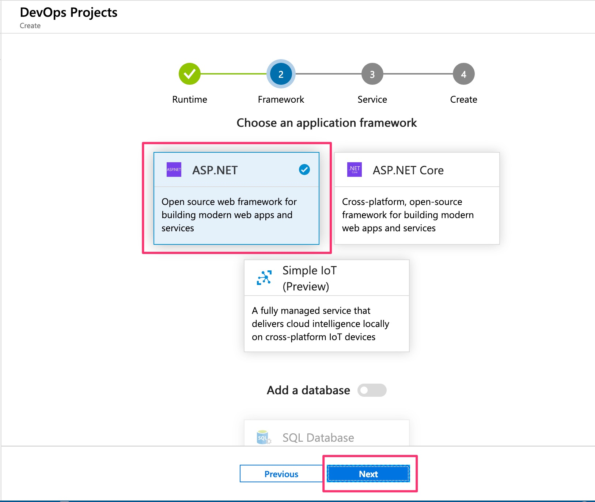
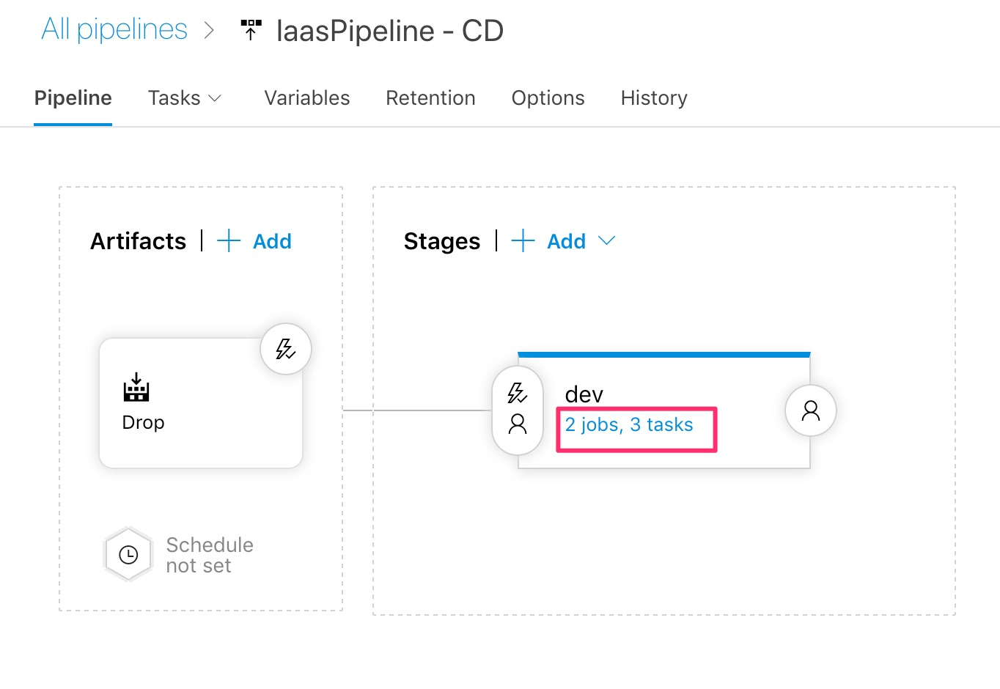

# Lab 5: IaaS Automation

[<- Lab 4: Failover between regions](https://github.com/gidavies/MovingToInfraAsCodeLab/blob/master/MoveIacLab4.md) | [Home](https://github.com/gidavies/MovingToInfraAsCodeLab/blob/master/README.md)

This lab will cover automating the provisioning of infrastructure as part of a continuous delivery pipeline using Azure DevOps.

1. In the Azure Portal search services for DevOps Projects and select it:

2. Select Add:

3. Select .NET and Next:

4. Select ASP.NET and Next:

5. Select Virtual Machine and Next:

6. The next step will create an Azure DevOps project with a release pipeline. Enter a name for the project, choose your Azure DevOps organisation (or enter a unique name to create one), and select the region:

7. Scroll down to find additional settings. Make any changes you'd like to here including creating a new Azure DevOps organisation, changing the resource group name and other settings. Click OK and then done:

8. Wait a short time (30 secs or so) and the Portal will display the progress of the DevOps project:

9. After another short time you should see that the deployment is complete (try the refresh button if not). Click on Go to resource:

10. This summary screen is showing that some sample code has been imported and a build definition created and the build is in progress. For this lab the key aspect is the release pipeline that has also been created (but at this point not yet run). Click on Release pipelines:

11. Click Edit to see what has been configured in the release pipeline:

12. You are now looking at a release pipeline deploying to one stage, called Dev. In reality you'd add more (such as Test and Production) but for now we'll take a look at how the dev stage is being automatically deployed to. Click in dev where it says 2 jobs, 3 tasks:

13. The first step is to provision the virtual machine using an ARM Template:

14. Click on the first task and scroll down on the right hand side to see the ARM Template and parameter settings:

Note that the task action is Create or update resource group - i.e. if it doesn't exist, create it, if it does exist then update it to match the ARM Template. Changes are being rolled out from the ARM Template into deployment.

15. Finally, go back to the Azure Portal and refresh the deployment page and you should see that it is complete. The release has provisioned a Windows VM and deployed a sample web application into IIS on that machine. Click on the application endpoint if you want to see the deployed app:

To tidy up in the Azure DevOps project area in the Azure Portal, select the project you just created and select Delete to remove the resources.

Another that lab that may be of interest is how to [deploy the UK Official IaaS Reference Architecture using ARM Templates and Azure DevOps](https://github.com/gidavies/AzureDevOps-UKGovRefArch)

[<- Lab 4: Failover between regions](https://github.com/gidavies/MovingToInfraAsCodeLab/blob/master/MoveIacLab4.md) | [Home](https://github.com/gidavies/MovingToInfraAsCodeLab/blob/master/README.md)
